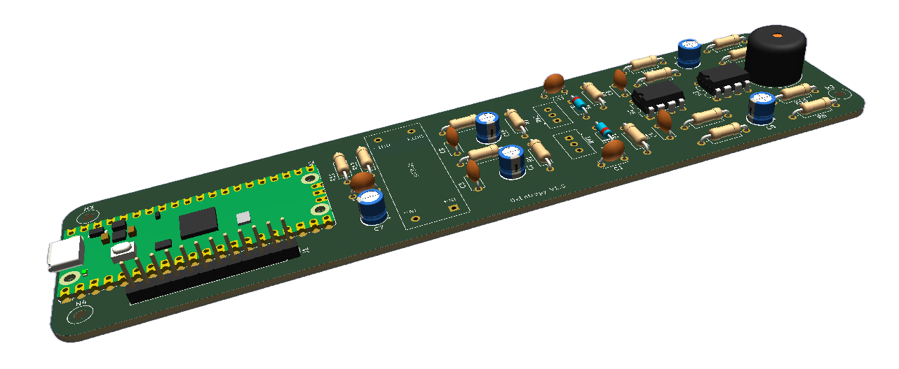
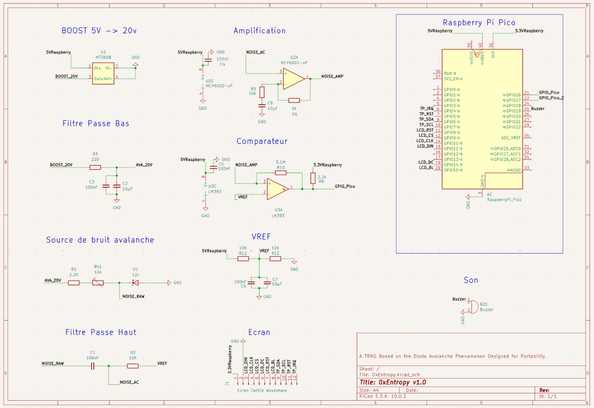
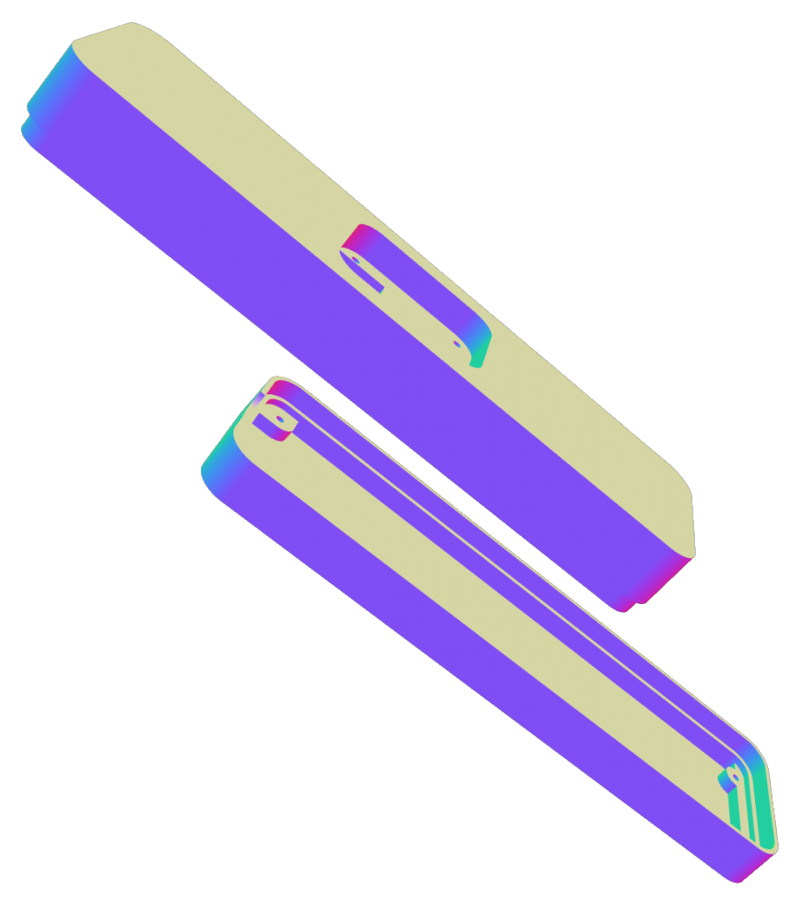
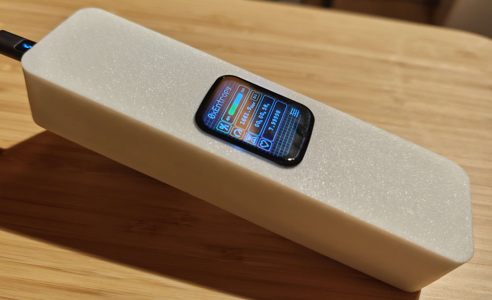
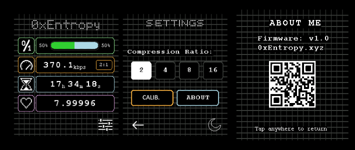
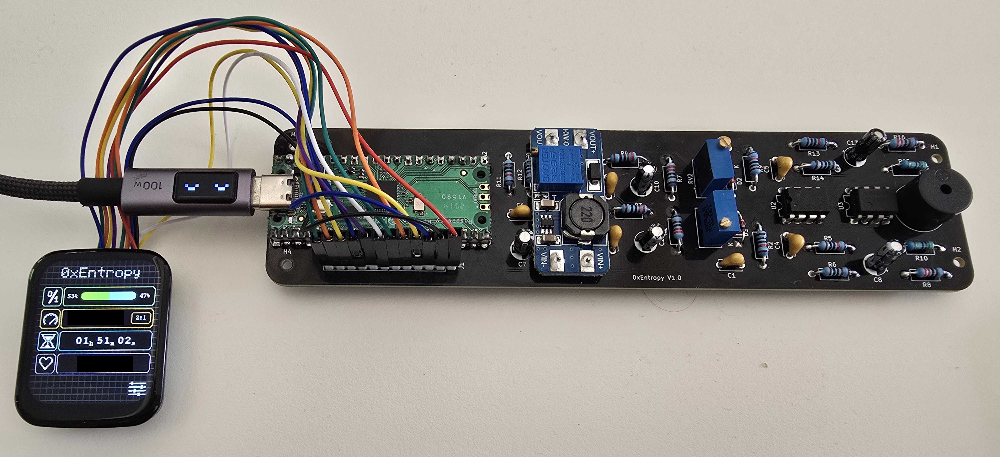

<h1 align="center">0xEntropy</h1>

<p align="center">
  
</p>

<p align="center">
  <em>Générateur physique de nombres aléatoires (TRNG) compact, open-source et alimenté en USB, basé sur le bruit d'avalanche d'une diode Zener et propulsé par un RP2040.</em>
</p>

---

## En bref

**0xEntropy** est un générateur d'entropie matérielle autonome. Il exploite le phénomène physique de claquage par avalanche d'une diode Zener pour capter un bruit quantique non-déterministe, l'amplifie, le numérise à haute vitesse via les machines d'états PIO d'un Raspberry Pi Pico, et applique un blanchiment cryptographique SHA-256 en temps réel.

Le système intègre un écran de contrôle tactile, des tests de santé continus et transmet le flux aléatoire via USB.

---

## Caractéristiques

- **Source physique pure** : Bruit d'avalanche d'une diode Zener 12V polarisée en inverse, filtré et amplifié (MCP6002).
- **Masse virtuelle filtrée ($V_{REF} = 2.5\text{V}$)** : Isolation stricte contre le bruit parasite de l'alimentation USB.
- **Échantillonnage matériel (PIO)** : Capture haute vitesse déchargée du CPU.
- **Architecture Multicœur (RP2040)** :
  - **Core 0** : Interface LCD tactile (moteur de rendu bitmap 1-bit ultra-léger), gestion des statistiques et alertes. 
  - **Core 1** : Acquisition brute, tests de santé statistiques et post-traitement SHA-256.
- **Monitoring en direct** : Affichage temps réel de l'entropie de Shannon et supervision de l'état de la source.
- **100% Plug & Play** : Alimenté et interrogé via un simple port USB.

---

## Matériel & Schémas (KiCad)

Le PCB isole la chaîne analogique sensible (Zener, ampli, comparateur) de la section numérique (RP2040, écran).

### Schéma électronique


### Conception du PCB


---

## Boîtier & Intégration 3D

Un boîtier sur mesure a été modélisé pour intégrer la carte, l'écran tactile et le port micro-USB.

<table>
  <tr>
    <th width="50%" align="center">Modèle 3D</th>
    <th width="50%" align="center">Prototype assemblé</th>
  </tr>
  <tr>
    <td align="center">
      
    </td>
    <td align="center">
      
    </td>
  </tr>
</table>

*(Les fichiers F3D / STEP sont disponibles dans le dossier `/file3D`)*

---

## Structure du Firmware

Le firmware est développé en **C/C++** avec le Pico SDK :

- `firmware/0xEntropy.c` : Point d'entrée principal, orchestration et boucle centrale.
- `firmware/Entropy/` : Échantillonnage du signal physique et génération du flux aléatoire.
- `firmware/Health/` : Tests de santé continus (détection de panne ou de dérive de la source).
- `firmware/Stats/` : Calculs statistiques en temps réel sur les flux de bits.
- `firmware/UI/` : Gestion de l'affichage et de l'interface utilisateur.

<p align="center">
  
  <br>
  <em>Valeur fictive</em>
</p>

---

## Aperçu du prototype complet

Vue d'ensemble du matériel assemblé : le PCB opérationnel connecté à l'écran de contrôle tactile.

<p align="center">
  
  <br>
  <em>Carte 0xEntropy finale assemblée et connectée à son écran tactile</em>
</p>

---

## Démarrage rapide

### 1. Flasher le RP2040
1. Télécharge la dernière version `0xEntropy.uf2` dans les [Releases](../../releases).
2. Maintiens le bouton **BOOTSEL** du Raspberry Pi Pico et branche-le en USB.
3. Glisse-dépose le fichier `.uf2` sur le lecteur USB.

### 2. Récupérer les octets aléatoires

Le Pico émule un port série USB standard (CDC).

#### Option A : Via le script Python (Recommandé / Multiplateforme)
Gère le suivi du débit en direct, la reprise en cas de coupure et fonctionne sous Windows/Linux/macOS :

```bash
# Dépendance
pip install pyserial

# Capture (ex: 100 Mo)
python collect.py -p COM4 -s 100000000 -o random.bin
```

#### Option B : Ligne de commande directe (Linux / macOS)
```bash
# Capture rapide de 1 Mo
head -c 1M /dev/ttyACM0 > random.bin
```

---

### 3. Valider la qualité de l'entropie

Test rapide de la distribution avec l'outil standard `ent` :

```bash
ent random.bin
```

Tests statistiques complets avec la suite **Dieharder** :

```bash
# Lancer la batterie complète de tests (-a) sur un fichier binaire (-g 201)
dieharder -a -g 201 -f random.bin
```

---

## Performances & Validation

Le système a été validé sur la conformité statistique à très grande échelle.

- **Débit moyen constaté** : **~1 300 kbps** (~162 Ko/s) transmis en continu via le port série USB (CDC).
- **Post-traitement** : Blanchiment SHA-256 avec un ratio de compression matériel de **2:1** (512 bits bruts injectés pour 256 bits générés).

---

### 1. Test `ent` (Échantillon de 10 Go)

Analyse de distribution brute réalisée sur un fichier généré de **10 Go** (`10 000 000 000 octets`) :

```text
Entropy = 8.000000 bits per byte.

Optimum compression would reduce the size
of this 10000000000 byte file by 0 percent.

Chi square distribution for 10000000000 samples is 279.96, and randomly
would exceed this value 13.56 percent of the times.

Arithmetic mean value of data bytes is 127.5013 (127.5 = random).
Monte Carlo value for Pi is 3.141522385 (error 0.00 percent).
Serial correlation coefficient is -0.000013 (totally uncorrelated = 0.0).
```

---

### 2. Suite de tests Dieharder (Fichier de 10 Go)

Résultats complets de la batterie de tests **Dieharder v3.31.1** exécutée sur un flux de **10 Go** (ratio SHA-256 2:1) :


<details>
<summary><b>Clique pour voir les 86 tests détaillés (Dieharder)</b></summary>

| Test Name | ntuple | tsamples | psamples | p-value | Assessment |
| :--- | :---: | :---: | :---: | :---: | :---: |
| `diehard_birthdays` | 0 | 100 | 100 | 0.39466437 | **PASSED** |
| `diehard_operm5` | 0 | 1 000 000 | 100 | 0.07592355 | **PASSED** |
| `diehard_rank_32x32` | 0 | 40 000 | 100 | 0.59062810 | **PASSED** |
| `diehard_rank_6x8` | 0 | 100 000 | 100 | 0.95475163 | **PASSED** |
| `diehard_bitstream` | 0 | 2 097 152 | 100 | 0.40506079 | **PASSED** |
| `diehard_opso` | 0 | 2 097 152 | 100 | 0.88837531 | **PASSED** |
| `diehard_oqso` | 0 | 2 097 152 | 100 | 0.69125958 | **PASSED** |
| `diehard_dna` | 0 | 2 097 152 | 100 | 0.69906629 | **PASSED** |
| `diehard_count_1s_str` | 0 | 256 000 | 100 | 0.39737472 | **PASSED** |
| `diehard_count_1s_byt` | 0 | 256 000 | 100 | 0.92060347 | **PASSED** |
| `diehard_parking_lot` | 0 | 12 000 | 100 | 0.43926798 | **PASSED** |
| `diehard_2dsphere` | 2 | 8 000 | 100 | 0.92344609 | **PASSED** |
| `diehard_3dsphere` | 3 | 4 000 | 100 | 0.96173291 | **PASSED** |
| `diehard_squeeze` | 0 | 100 000 | 100 | 0.79221232 | **PASSED** |
| `diehard_sums` | 0 | 100 | 100 | 0.55542507 | **PASSED** |
| `diehard_runs` | 0 | 100 000 | 100 | 0.13786658 | **PASSED** |
| `diehard_runs` | 0 | 100 000 | 100 | 0.17085449 | **PASSED** |
| `diehard_craps` | 0 | 200 000 | 100 | 0.67687026 | **PASSED** |
| `diehard_craps` | 0 | 200 000 | 100 | 0.91082777 | **PASSED** |
| `marsaglia_tsang_gcd` | 0 | 10 000 000 | 100 | 0.93839213 | **PASSED** |
| `marsaglia_tsang_gcd` | 0 | 10 000 000 | 100 | 0.84764647 | **PASSED** |
| `sts_monobit` | 1 | 100 000 | 100 | 0.28551441 | **PASSED** |
| `sts_runs` | 2 | 100 000 | 100 | 0.29973049 | **PASSED** |
| `sts_serial` | 1 | 100 000 | 100 | 0.45563392 | **PASSED** |
| `sts_serial` | 2 | 100 000 | 100 | 0.14689616 | **PASSED** |
| `sts_serial` | 3 | 100 000 | 100 | 0.16976266 | **PASSED** |
| `sts_serial` | 3 | 100 000 | 100 | 0.58643956 | **PASSED** |
| `sts_serial` | 4 | 100 000 | 100 | 0.62041623 | **PASSED** |
| `sts_serial` | 4 | 100 000 | 100 | 0.93374301 | **PASSED** |
| `sts_serial` | 5 | 100 000 | 100 | 0.42325503 | **PASSED** |
| `sts_serial` | 5 | 100 000 | 100 | 0.96197560 | **PASSED** |
| `sts_serial` | 6 | 100 000 | 100 | 0.21788455 | **PASSED** |
| `sts_serial` | 6 | 100 000 | 100 | 0.69535327 | **PASSED** |
| `sts_serial` | 7 | 100 000 | 100 | 0.03066406 | **PASSED** |
| `sts_serial` | 7 | 100 000 | 100 | 0.01328619 | **PASSED** |
| `sts_serial` | 8 | 100 000 | 100 | 0.62365992 | **PASSED** |
| `sts_serial` | 8 | 100 000 | 100 | 0.28004021 | **PASSED** |
| `sts_serial` | 9 | 100 000 | 100 | 0.90096448 | **PASSED** |
| `sts_serial` | 9 | 100 000 | 100 | 0.97761790 | **PASSED** |
| `sts_serial` | 10 | 100 000 | 100 | 0.51356615 | **PASSED** |
| `sts_serial` | 10 | 100 000 | 100 | 0.64523823 | **PASSED** |
| `sts_serial` | 11 | 100 000 | 100 | 0.93859732 | **PASSED** |
| `sts_serial` | 11 | 100 000 | 100 | 0.32514183 | **PASSED** |
| `sts_serial` | 12 | 100 000 | 100 | 0.19453278 | **PASSED** |
| `sts_serial` | 12 | 100 000 | 100 | 0.35736285 | **PASSED** |
| `sts_serial` | 13 | 100 000 | 100 | 0.41024144 | **PASSED** |
| `sts_serial` | 13 | 100 000 | 100 | 0.52009147 | **PASSED** |
| `sts_serial` | 14 | 100 000 | 100 | 0.63356596 | **PASSED** |
| `sts_serial` | 14 | 100 000 | 100 | 0.05597814 | **PASSED** |
| `sts_serial` | 15 | 100 000 | 100 | 0.44014124 | **PASSED** |
| `sts_serial` | 15 | 100 000 | 100 | 0.17108281 | **PASSED** |
| `sts_serial` | 16 | 100 000 | 100 | 0.83506756 | **PASSED** |
| `sts_serial` | 16 | 100 000 | 100 | 0.92781694 | **PASSED** |
| `rgb_bitdist` | 1 | 100 000 | 100 | 0.50215495 | **PASSED** |
| `rgb_bitdist` | 2 | 100 000 | 100 | 0.67467770 | **PASSED** |
| `rgb_bitdist` | 3 | 100 000 | 100 | 0.68604339 | **PASSED** |
| `rgb_bitdist` | 4 | 100 000 | 100 | 0.63639093 | **PASSED** |
| `rgb_bitdist` | 5 | 100 000 | 100 | 0.00711522 | **PASSED** |
| `rgb_bitdist` | 6 | 100 000 | 100 | 0.03642615 | **PASSED** |
| `rgb_bitdist` | 7 | 100 000 | 100 | 0.54886931 | **PASSED** |
| `rgb_bitdist` | 8 | 100 000 | 100 | 0.94844778 | **PASSED** |
| `rgb_bitdist` | 9 | 100 000 | 100 | 0.80804374 | **PASSED** |
| `rgb_bitdist` | 10 | 100 000 | 100 | 0.76694934 | **PASSED** |
| `rgb_bitdist` | 11 | 100 000 | 100 | 0.55405954 | **PASSED** |
| `rgb_bitdist` | 12 | 100 000 | 100 | 0.79849495 | **PASSED** |
| `rgb_minimum_distance` | 2 | 10 000 | 1000 | 0.38755637 | **PASSED** |
| `rgb_minimum_distance` | 3 | 10 000 | 1000 | 0.93853771 | **PASSED** |
| `rgb_minimum_distance` | 4 | 10 000 | 1000 | 0.63970846 | **PASSED** |
| `rgb_minimum_distance` | 5 | 10 000 | 1000 | 0.33087978 | **PASSED** |
| `rgb_permutations` | 2 | 100 000 | 100 | 0.80472843 | **PASSED** |
| `rgb_permutations` | 3 | 100 000 | 100 | 0.80939095 | **PASSED** |
| `rgb_permutations` | 4 | 100 000 | 100 | 0.64196966 | **PASSED** |
| `rgb_permutations` | 5 | 100 000 | 100 | 0.97396760 | **PASSED** |
| `rgb_lagged_sum` | 0 | 1 000 000 | 100 | 0.29546209 | **PASSED** |
| `rgb_lagged_sum` | 1 | 1 000 000 | 100 | 0.10736047 | **PASSED** |
| `rgb_lagged_sum` | 2 | 1 000 000 | 100 | 0.90786168 | **PASSED** |
| `rgb_lagged_sum` | 3 | 1 000 000 | 100 | 0.03800803 | **PASSED** |
| `rgb_lagged_sum` | 4 | 1 000 000 | 100 | 0.69745767 | **PASSED** |
| `rgb_lagged_sum` | 5 | 1 000 000 | 100 | 0.30052203 | **PASSED** |
| `rgb_lagged_sum` | 6 | 1 000 000 | 100 | 0.81286624 | **PASSED** |
| `rgb_lagged_sum` | 7 | 1 000 000 | 100 | 0.79490517 | **PASSED** |
| `rgb_lagged_sum` | 8 | 1 000 000 | 100 | 0.85376675 | **PASSED** |
| `rgb_lagged_sum` | 9 | 1 000 000 | 100 | 0.46383055 | **PASSED** |
| `rgb_lagged_sum` | 10 | 1 000 000 | 100 | 0.63063661 | **PASSED** |
| `rgb_lagged_sum` | 11 | 1 000 000 | 100 | 0.39341615 | **PASSED** |
| `rgb_lagged_sum` | 12 | 1 000 000 | 100 | 0.21353291 | **PASSED** |
| `rgb_lagged_sum` | 13 | 1 000 000 | 100 | 0.73964502 | **PASSED** |
| `rgb_lagged_sum` | 14 | 1 000 000 | 100 | 0.76922594 | **PASSED** |
| `rgb_lagged_sum` | 15 | 1 000 000 | 100 | 0.55600967 | **PASSED** |
| `rgb_lagged_sum` | 16 | 1 000 000 | 100 | 0.59271918 | **PASSED** |
| `rgb_lagged_sum` | 17 | 1 000 000 | 100 | 0.90342589 | **PASSED** |
| `rgb_lagged_sum` | 18 | 1 000 000 | 100 | 0.59641374 | **PASSED** |
| `rgb_lagged_sum` | 19 | 1 000 000 | 100 | 0.59765640 | **PASSED** |
| `rgb_lagged_sum` | 20 | 1 000 000 | 100 | 0.52991615 | **PASSED** |
| `rgb_lagged_sum` | 21 | 1 000 000 | 100 | 0.44300317 | **PASSED** |
| `rgb_lagged_sum` | 22 | 1 000 000 | 100 | 0.94796060 | **PASSED** |
| `rgb_lagged_sum` | 23 | 1 000 000 | 100 | 0.20987094 | **PASSED** |
| `rgb_lagged_sum` | 24 | 1 000 000 | 100 | 0.36604221 | **PASSED** |
| `rgb_lagged_sum` | 25 | 1 000 000 | 100 | 0.28560285 | **PASSED** |
| `rgb_lagged_sum` | 26 | 1 000 000 | 100 | 0.52958989 | **PASSED** |
| `rgb_lagged_sum` | 27 | 1 000 000 | 100 | 0.17134459 | **PASSED** |
| `rgb_lagged_sum` | 28 | 1 000 000 | 100 | 0.99634800 | *WEAK* |
| `rgb_lagged_sum` | 29 | 1 000 000 | 100 | 0.36655513 | **PASSED** |
| `rgb_lagged_sum` | 30 | 1 000 000 | 100 | 0.16353244 | **PASSED** |
| `rgb_lagged_sum` | 31 | 1 000 000 | 100 | 0.36323221 | **PASSED** |
| `rgb_lagged_sum` | 32 | 1 000 000 | 100 | 0.67537924 | **PASSED** |
| `rgb_kstest_test` | 0 | 10 000 | 1000 | 0.60363864 | **PASSED** |
| `dab_bytedistrib` | 0 | 51 200 000 | 1 | 0.70763534 | **PASSED** |
| `dab_dct` | 256 | 50 000 | 1 | 0.18425080 | **PASSED** |
| `dab_filltree` | 32 | 15 000 000 | 1 | 0.80178758 | **PASSED** |
| `dab_filltree` | 32 | 15 000 000 | 1 | 0.26571865 | **PASSED** |
| `dab_filltree2` | 0 | 5 000 000 | 1 | 0.69465598 | **PASSED** |
| `dab_filltree2` | 1 | 5 000 000 | 1 | 0.71074721 | **PASSED** |
| `dab_monobit2` | 12 | 65 000 000 | 1 | 0.57586976 | **PASSED** |

</details>