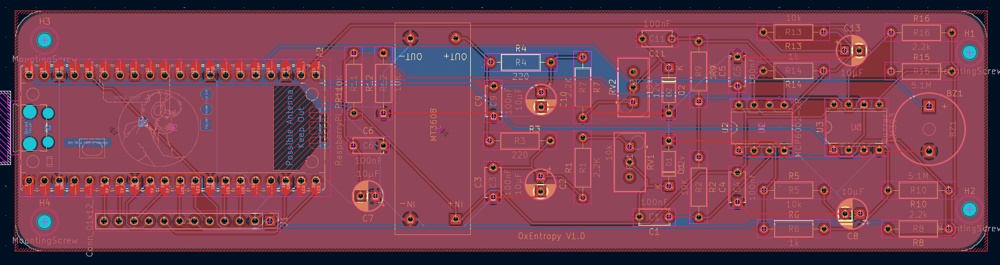

<h1 align="center">0xEntropy</h1>

<p align="center">
  
</p>

<p align="center">
  <em>Compact, open-source, USB-powered True Random Number Generator (TRNG) based on Zener diode avalanche breakdown noise and powered by an RP2040.</em>
</p>

---

## Overview

**0xEntropy** is a standalone hardware entropy generator. It harnesses the physical phenomenon of avalanche breakdown in a Zener diode to capture non-deterministic quantum noise, amplifies it, digitizes it at high speed using the Raspberry Pi Pico PIO state machines, and applies real-time SHA-256 cryptographic whitening.

The system features an onboard touchscreen interface, continuous health monitoring, and streams random data over USB.

---

## Features

- **Pure Physical Source**: Avalanche breakdown noise from a reverse-biased 12V Zener diode, filtered and amplified (MCP6002).
- **Filtered Virtual Ground ($V_{REF} = 2.5\text{V}$)**: Strict isolation against USB power rail noise and ripples.
- **Hardware Sampling (PIO)**: High-speed, jitter-free capture offloaded from the CPU.
- **Dual-Core Architecture (RP2040)**:
  - **Core 0**: Touchscreen LCD interface (ultra-lightweight 1-bit bitmap rendering engine), statistics processing, and alerts.
  - **Core 1**: Raw bit acquisition, real-time statistical health tests, and SHA-256 post-processing.
- **Live Monitoring**: Real-time Shannon entropy calculation and physical source health supervision.
- **100% Plug & Play**: Powered and queried via a standard USB port.

---

## Hardware & Schematics (KiCad)

The PCB isolates the sensitive analog front-end (Zener, op-amp, comparator) from the digital domain (RP2040, screen).

### Schematic


### PCB Layout


---

## Enclosure & 3D Design

A custom 3D enclosure was designed to house the main board, the touchscreen display, and provide access to the micro-USB port.

<table>
  <tr>
    <th width="50%" align="center">3D Model</th>
    <th width="50%" align="center">Assembled Prototype</th>
  </tr>
  <tr>
    <td align="center">
      
    </td>
    <td align="center">
      
    </td>
  </tr>
</table>

<p align="center">
  
  <br>
  <em>Enclosure 3D printing timelapse</em>
</p>

*(F3D / STEP source files are available in the `/file3D` directory)*

---

## Firmware Structure

The firmware is written in **C/C++** using the Pico SDK:

- `firmware/0xEntropy.c`: Main entry point, orchestration, and core loop.
- `firmware/Entropy/`: Physical signal sampling and entropy generation routines.
- `firmware/Health/`: Continuous health monitoring (failure detection and drift detection).
- `firmware/Stats/`: Real-time statistical computations on bitstreams.
- `firmware/UI/`: Display drivers and user interface logic.

<p align="center">
  
  <br>
  <em>Simulated values</em>
</p>

---

## Full Prototype Overview

Overall view of the assembled hardware: the operational PCB connected to the touchscreen display.

<p align="center">
  
  <br>
  <em>Final 0xEntropy board assembled and connected to its touchscreen display</em>
</p>

---

## Quick Start

### 1. Flash the RP2040
1. Download the latest `0xEntropy.uf2` binary from the [Releases](../../releases).
2. Hold down the **BOOTSEL** button on the Raspberry Pi Pico and plug it into your computer via USB.
3. Drag and drop the `.uf2` file onto the mounted USB storage volume.

### 2. Stream Random Bytes

The Pico emulates a standard USB CDC serial port.

#### Option A: Using the Python Script (Recommended / Cross-platform)
Handles real-time throughput monitoring, automatic resume on disconnect, and works on Windows, Linux, and macOS:

```bash
# Dependency
pip install pyserial

# Stream data (e.g., capture 100 MB)
python collect.py -p COM4 -s 100000000 -o random.bin
```

#### Option B: Direct Command Line (Linux / macOS)
```bash
# Quick capture of 1 MB
head -c 1M /dev/ttyACM0 > random.bin
```

---

### 3. Verify Entropy Quality

Quick distribution analysis using the standard `ent` tool:

```bash
ent random.bin
```

Comprehensive statistical test battery with **Dieharder**:

```bash
# Run the full test suite (-a) on a binary stream (-g 201)
dieharder -a -g 201 -f random.bin
```

---

## Performance & Validation

The generator has been rigorously tested and validated for statistical randomness at scale.

- **Observed Throughput**: **~1,300 kbps** (~162 KB/s) continuous stream over USB CDC.
- **Post-Processing**: SHA-256 cryptographic whitening with a **2:1** hardware compression ratio (512 raw bits consumed per 256 output bits).

---

### 1. `ent` Test (10 GB Dataset)

Raw distribution analysis performed on a continuous **10 GB** dataset (`10,000,000,000 bytes`):

```text
Entropy = 8.000000 bits per byte.

Optimum compression would reduce the size
of this 10000000000 byte file by 0 percent.

Chi square distribution for 10000000000 samples is 279.96, and randomly
would exceed this value 13.56 percent of the times.

Arithmetic mean value of data bytes is 127.5013 (127.5 = random).
Monte Carlo value for Pi is 3.141522385 (error 0.00 percent).
Serial correlation coefficient is -0.000013 (totally uncorrelated = 0.0).
```

---

### 2. Dieharder Test Suite (10 GB Dataset)

Full results from the **Dieharder v3.31.1** test battery executed against a **10 GB** stream (SHA-256 2:1 ratio):

<details>

<summary><b>Click to view all 86 detailed test results (Dieharder)</b></summary>

| Test Name | ntuple | tsamples | psamples | p-value | Assessment |
| :--- | :---: | :---: | :---: | :---: | :---: |
| `diehard_birthdays` | 0 | 100 | 100 | 0.39466437 | **PASSED** |
| `diehard_operm5` | 0 | 1 000 000 | 100 | 0.07592355 | **PASSED** |
| `diehard_rank_32x32` | 0 | 40 000 | 100 | 0.59062810 | **PASSED** |
| `diehard_rank_6x8` | 0 | 100 000 | 100 | 0.95475163 | **PASSED** |
| `diehard_bitstream` | 0 | 2 097 152 | 100 | 0.40506079 | **PASSED** |
| `diehard_opso` | 0 | 2 097 152 | 100 | 0.88837531 | **PASSED** |
| `diehard_oqso` | 0 | 2 097 152 | 100 | 0.69125958 | **PASSED** |
| `diehard_dna` | 0 | 2 097 152 | 100 | 0.69906629 | **PASSED** |
| `diehard_count_1s_str` | 0 | 256 000 | 100 | 0.39737472 | **PASSED** |
| `diehard_count_1s_byt` | 0 | 256 000 | 100 | 0.92060347 | **PASSED** |
| `diehard_parking_lot` | 0 | 12 000 | 100 | 0.43926798 | **PASSED** |
| `diehard_2dsphere` | 2 | 8 000 | 100 | 0.92344609 | **PASSED** |
| `diehard_3dsphere` | 3 | 4 000 | 100 | 0.96173291 | **PASSED** |
| `diehard_squeeze` | 0 | 100 000 | 100 | 0.79221232 | **PASSED** |
| `diehard_sums` | 0 | 100 | 100 | 0.55542507 | **PASSED** |
| `diehard_runs` | 0 | 100 000 | 100 | 0.13786658 | **PASSED** |
| `diehard_runs` | 0 | 100 000 | 100 | 0.17085449 | **PASSED** |
| `diehard_craps` | 0 | 200 000 | 100 | 0.67687026 | **PASSED** |
| `diehard_craps` | 0 | 200 000 | 100 | 0.91082777 | **PASSED** |
| `marsaglia_tsang_gcd` | 0 | 10 000 000 | 100 | 0.93839213 | **PASSED** |
| `marsaglia_tsang_gcd` | 0 | 10 000 000 | 100 | 0.84764647 | **PASSED** |
| `sts_monobit` | 1 | 100 000 | 100 | 0.28551441 | **PASSED** |
| `sts_runs` | 2 | 100 000 | 100 | 0.29973049 | **PASSED** |
| `sts_serial` | 1 | 100 000 | 100 | 0.45563392 | **PASSED** |
| `sts_serial` | 2 | 100 000 | 100 | 0.14689616 | **PASSED** |
| `sts_serial` | 3 | 100 000 | 100 | 0.16976266 | **PASSED** |
| `sts_serial` | 3 | 100 000 | 100 | 0.58643956 | **PASSED** |
| `sts_serial` | 4 | 100 000 | 100 | 0.62041623 | **PASSED** |
| `sts_serial` | 4 | 100 000 | 100 | 0.93374301 | **PASSED** |
| `sts_serial` | 5 | 100 000 | 100 | 0.42325503 | **PASSED** |
| `sts_serial` | 5 | 100 000 | 100 | 0.96197560 | **PASSED** |
| `sts_serial` | 6 | 100 000 | 100 | 0.21788455 | **PASSED** |
| `sts_serial` | 6 | 100 000 | 100 | 0.69535327 | **PASSED** |
| `sts_serial` | 7 | 100 000 | 100 | 0.03066406 | **PASSED** |
| `sts_serial` | 7 | 100 000 | 100 | 0.01328619 | **PASSED** |
| `sts_serial` | 8 | 100 000 | 100 | 0.62365992 | **PASSED** |
| `sts_serial` | 8 | 100 000 | 100 | 0.28004021 | **PASSED** |
| `sts_serial` | 9 | 100 000 | 100 | 0.90096448 | **PASSED** |
| `sts_serial` | 9 | 100 000 | 100 | 0.97761790 | **PASSED** |
| `sts_serial` | 10 | 100 000 | 100 | 0.51356615 | **PASSED** |
| `sts_serial` | 10 | 100 000 | 100 | 0.64523823 | **PASSED** |
| `sts_serial` | 11 | 100 000 | 100 | 0.93859732 | **PASSED** |
| `sts_serial` | 11 | 100 000 | 100 | 0.32514183 | **PASSED** |
| `sts_serial` | 12 | 100 000 | 100 | 0.19453278 | **PASSED** |
| `sts_serial` | 12 | 100 000 | 100 | 0.35736285 | **PASSED** |
| `sts_serial` | 13 | 100 000 | 100 | 0.41024144 | **PASSED** |
| `sts_serial` | 13 | 100 000 | 100 | 0.52009147 | **PASSED** |
| `sts_serial` | 14 | 100 000 | 100 | 0.63356596 | **PASSED** |
| `sts_serial` | 14 | 100 000 | 100 | 0.05597814 | **PASSED** |
| `sts_serial` | 15 | 100 000 | 100 | 0.44014124 | **PASSED** |
| `sts_serial` | 15 | 100 000 | 100 | 0.17108281 | **PASSED** |
| `sts_serial` | 16 | 100 000 | 100 | 0.83506756 | **PASSED** |
| `sts_serial` | 16 | 100 000 | 100 | 0.92781694 | **PASSED** |
| `rgb_bitdist` | 1 | 100 000 | 100 | 0.50215495 | **PASSED** |
| `rgb_bitdist` | 2 | 100 000 | 100 | 0.67467770 | **PASSED** |
| `rgb_bitdist` | 3 | 100 000 | 100 | 0.68604339 | **PASSED** |
| `rgb_bitdist` | 4 | 100 000 | 100 | 0.63639093 | **PASSED** |
| `rgb_bitdist` | 5 | 100 000 | 100 | 0.00711522 | **PASSED** |
| `rgb_bitdist` | 6 | 100 000 | 100 | 0.03642615 | **PASSED** |
| `rgb_bitdist` | 7 | 100 000 | 100 | 0.54886931 | **PASSED** |
| `rgb_bitdist` | 8 | 100 000 | 100 | 0.94844778 | **PASSED** |
| `rgb_bitdist` | 9 | 100 000 | 100 | 0.80804374 | **PASSED** |
| `rgb_bitdist` | 10 | 100 000 | 100 | 0.76694934 | **PASSED** |
| `rgb_bitdist` | 11 | 100 000 | 100 | 0.55405954 | **PASSED** |
| `rgb_bitdist` | 12 | 100 000 | 100 | 0.79849495 | **PASSED** |
| `rgb_minimum_distance` | 2 | 10 000 | 1000 | 0.38755637 | **PASSED** |
| `rgb_minimum_distance` | 3 | 10 000 | 1000 | 0.93853771 | **PASSED** |
| `rgb_minimum_distance` | 4 | 10 000 | 1000 | 0.63970846 | **PASSED** |
| `rgb_minimum_distance` | 5 | 10 000 | 1000 | 0.33087978 | **PASSED** |
| `rgb_permutations` | 2 | 100 000 | 100 | 0.80472843 | **PASSED** |
| `rgb_permutations` | 3 | 100 000 | 100 | 0.80939095 | **PASSED** |
| `rgb_permutations` | 4 | 100 000 | 100 | 0.64196966 | **PASSED** |
| `rgb_permutations` | 5 | 100 000 | 100 | 0.97396760 | **PASSED** |
| `rgb_lagged_sum` | 0 | 1 000 000 | 100 | 0.29546209 | **PASSED** |
| `rgb_lagged_sum` | 1 | 1 000 000 | 100 | 0.10736047 | **PASSED** |
| `rgb_lagged_sum` | 2 | 1 000 000 | 100 | 0.90786168 | **PASSED** |
| `rgb_lagged_sum` | 3 | 1 000 000 | 100 | 0.03800803 | **PASSED** |
| `rgb_lagged_sum` | 4 | 1 000 000 | 100 | 0.69745767 | **PASSED** |
| `rgb_lagged_sum` | 5 | 1 000 000 | 100 | 0.30052203 | **PASSED** |
| `rgb_lagged_sum` | 6 | 1 000 000 | 100 | 0.81286624 | **PASSED** |
| `rgb_lagged_sum` | 7 | 1 000 000 | 100 | 0.79490517 | **PASSED** |
| `rgb_lagged_sum` | 8 | 1 000 000 | 100 | 0.85376675 | **PASSED** |
| `rgb_lagged_sum` | 9 | 1 000 000 | 100 | 0.46383055 | **PASSED** |
| `rgb_lagged_sum` | 10 | 1 000 000 | 100 | 0.63063661 | **PASSED** |
| `rgb_lagged_sum` | 11 | 1 000 000 | 100 | 0.39341615 | **PASSED** |
| `rgb_lagged_sum` | 12 | 1 000 000 | 100 | 0.21353291 | **PASSED** |
| `rgb_lagged_sum` | 13 | 1 000 000 | 100 | 0.73964502 | **PASSED** |
| `rgb_lagged_sum` | 14 | 1 000 000 | 100 | 0.76922594 | **PASSED** |
| `rgb_lagged_sum` | 15 | 1 000 000 | 100 | 0.55600967 | **PASSED** |
| `rgb_lagged_sum` | 16 | 1 000 000 | 100 | 0.59271918 | **PASSED** |
| `rgb_lagged_sum` | 17 | 1 000 000 | 100 | 0.90342589 | **PASSED** |
| `rgb_lagged_sum` | 18 | 1 000 000 | 100 | 0.59641374 | **PASSED** |
| `rgb_lagged_sum` | 19 | 1 000 000 | 100 | 0.59765640 | **PASSED** |
| `rgb_lagged_sum` | 20 | 1 000 000 | 100 | 0.52991615 | **PASSED** |
| `rgb_lagged_sum` | 21 | 1 000 000 | 100 | 0.44300317 | **PASSED** |
| `rgb_lagged_sum` | 22 | 1 000 000 | 100 | 0.94796060 | **PASSED** |
| `rgb_lagged_sum` | 23 | 1 000 000 | 100 | 0.20987094 | **PASSED** |
| `rgb_lagged_sum` | 24 | 1 000 000 | 100 | 0.36604221 | **PASSED** |
| `rgb_lagged_sum` | 25 | 1 000 000 | 100 | 0.28560285 | **PASSED** |
| `rgb_lagged_sum` | 26 | 1 000 000 | 100 | 0.52958989 | **PASSED** |
| `rgb_lagged_sum` | 27 | 1 000 000 | 100 | 0.17134459 | **PASSED** |
| `rgb_lagged_sum` | 28 | 1 000 000 | 100 | 0.99634800 | *WEAK* |
| `rgb_lagged_sum` | 29 | 1 000 000 | 100 | 0.36655513 | **PASSED** |
| `rgb_lagged_sum` | 30 | 1 000 000 | 100 | 0.16353244 | **PASSED** |
| `rgb_lagged_sum` | 31 | 1 000 000 | 100 | 0.36323221 | **PASSED** |
| `rgb_lagged_sum` | 32 | 1 000 000 | 100 | 0.67537924 | **PASSED** |
| `rgb_kstest_test` | 0 | 10 000 | 1000 | 0.60363864 | **PASSED** |
| `dab_bytedistrib` | 0 | 51 200 000 | 1 | 0.70763534 | **PASSED** |
| `dab_dct` | 256 | 50 000 | 1 | 0.18425080 | **PASSED** |
| `dab_filltree` | 32 | 15 000 000 | 1 | 0.80178758 | **PASSED** |
| `dab_filltree` | 32 | 15 000 000 | 1 | 0.26571865 | **PASSED** |
| `dab_filltree2` | 0 | 5 000 000 | 1 | 0.69465598 | **PASSED** |
| `dab_filltree2` | 1 | 5 000 000 | 1 | 0.71074721 | **PASSED** |
| `dab_monobit2` | 12 | 65 000 000 | 1 | 0.57586976 | **PASSED** |

</details>
